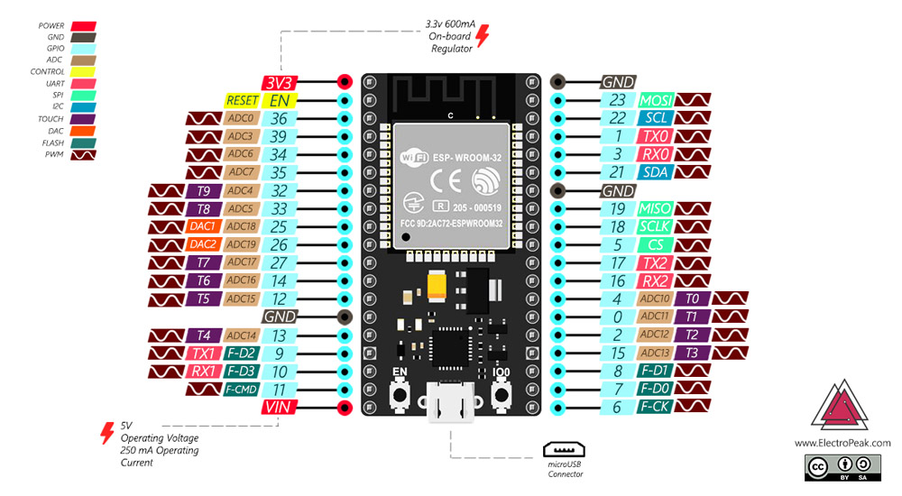
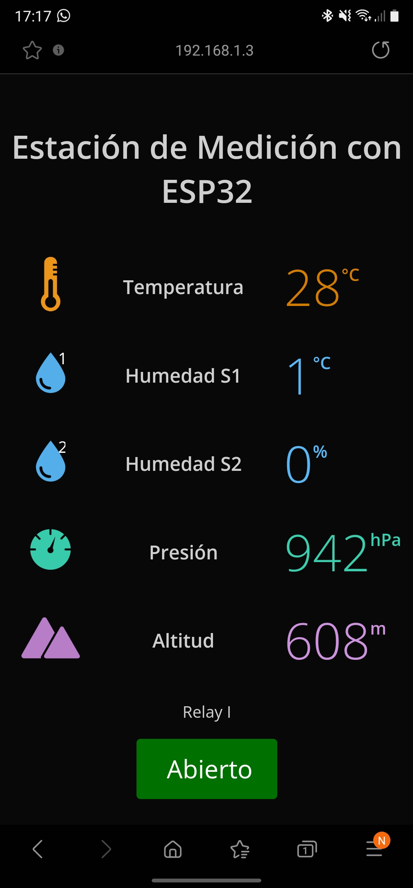

# Sistema de Control de Riego

Este proyecto busca desarrollar un sistema de control de riego por goteo mediante el uso de un SoC ESP-32. Se emplea codigo en C para el manejo de sensores de humedad del suelo y relativa, temperatura, presión atmosférica y control de electrovalvula. Se desarrolla una interfaza .html para la visualizacion y control del mismo.

## ESP-32

## Aplicacion web

